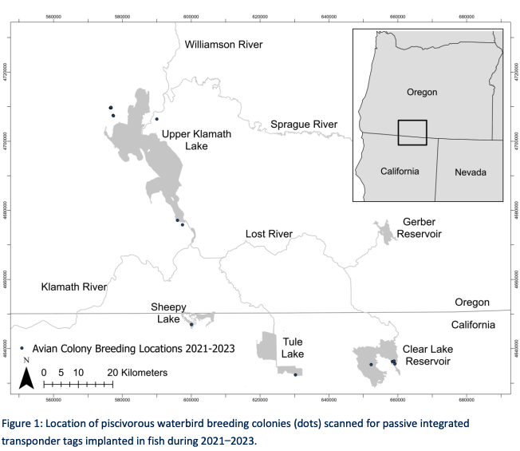

```{r setup, include=FALSE}
library(tidyverse)
library(httr)
library(jsonlite)
library(auk)
library(dplyr)
library(rnaturalearth)
library(sf)
library(ggplot2)
library(readr)
library(viridis)
library(lubridate)
library(ggrepel)

knitr::opts_chunk$set(
  echo = FALSE,
  message = FALSE,
  warning = FALSE,
  fig.width = 12, 
  fig.height = 12
)

theme_set(
  theme_minimal() +
    theme(
      plot.title = element_text(size = 16, face = "bold"),
      axis.title.x = element_text(size = 14),
      axis.title.y = element_text(size = 14), 
      legend.position = "bottom"
    )
)
```

## Define Geographies

```{r}
klamath_basin <- st_read(here::here("data-raw", "klamath_basin_outline/R8_FAC_Klamath_Basin_WFL1.shp")) |>
  st_transform(4326)

upper_klamath_lake_bbox <-c(-122.107301,42.214015,-121.787324,42.602368) 
clear_lake_bbox <- c(-121.289207, 41.781010,-121.015256, 41.995292)
tule_lake_bbox <- c(-121.598288, 41.800411, -121.347044, 41.995232)
bear_valley_bbox <- c(-121.979966,42.034977,-121.889353,42.096687)
lower_klamath_sheepy_bbox <- c(-121.851156,41.883384,-121.591674,42.033576)
klamath_marsh_bbox <- c(-121.806202,42.827148,-121.517889,43.072530)
```

```{r}
bbox_to_sfg <- function(b) {
  st_as_sfc(
    st_bbox(c(xmin = b[1], ymin = b[2], xmax = b[3], ymax = b[4]), crs = 4326)
  )[[1]]
}

bboxes_df <- tibble(
  site = c(
    "Upper Klamath Lake",
    "Clear Lake",
    "Tule Lake",
    "Bear Valley",
    "Lower Klamath (Sheepy)",
    "Klamath Marsh"
  ),
  bbox = list(
    upper_klamath_lake_bbox,
    clear_lake_bbox,
    tule_lake_bbox,
    bear_valley_bbox,
    lower_klamath_sheepy_bbox,
    klamath_marsh_bbox
  )
)

# build sf object correctly
bboxes_sf <- st_sf(
  site = bboxes_df$site,
  geometry = st_sfc(map(bboxes_df$bbox, bbox_to_sfg), crs = 4326)
)

labels_sf <- bboxes_sf |> mutate(geometry = st_point_on_surface(geometry))


ggplot() +
  geom_sf(data = klamath_basin) + 
  geom_sf(data = bboxes_sf, fill = NA, linewidth = 1) +
  geom_sf_text(data = labels_sf, aes(label = site), size = 3) +
  coord_sf(expand = FALSE) +
  theme_minimal() +
  labs(title = "Bounding boxes of the Klamath Marsh areas", x = NULL, y = NULL)

```

## Build Dataset {#dataset-details .tabset}

We compiled eBird observations from 2015–2025 for the Klamath Basin
watershed. These data were merged with BIRDBASE, which provides
information on each species’ primary habitat and diet. Additional
information on waterbirds was drawn from Donnelly et al. (2022). Further
details on each dataset are provided in the following tabs.

Below, we explore potential groupings of bird species based on these
combined sources [in the Bird Groupings section](#bird-groupings)

### eBird

##### Data Source

Data were obtained from the [eBird Basic Dataset
(EBD)](https://science.ebird.org/en/use-ebird-data/download-ebird-data-products)
via custom downloads. The following counties intersecting the Klamath
Basin were included:

-   California: Del Norte (CA-015), Humboldt (CA-023), Modoc (CA-049),
    Siskiyou (CA-093), Trinity (CA-105)

-   Oregon: Jackson (OR-029), Lake (OR-037), Klamath (OR-035)

Each download included:

-   Observation data (.txt)

-   Sampling event metadata (\_sampling.txt)

-   Data filtered using the
    [auk](https://cornelllabofornithology.github.io/auk/) R package

##### Spatial Filtering

All eBird data was clipped to the bounding boxes of the refuges.

#### Limitations and Biases

While eBird provides a vast and valuable source of bird observation
data, several **limitations and biases** must be considered when
interpreting species richness in the Klamath Basin:

#### Spatial and Temporal Bias

-   **Uneven geographic coverage**: Observations are concentrated near
    roads, towns, protected areas, or known birding hotspots rather than
    being evenly distributed across the basin.
-   **Accessibility**: Remote, rugged, or private lands are
    under-surveyed due to difficulty of access.
-   **Temporal bias**: Observations are skewed toward **weekends**,
    holidays, and the **month of May**, when birding activity typically
    increases due to spring migration and favorable weather.

#### Observer Skill and Experience

-   Bird detection and identification are highly dependent on the skill
    level of the observer:
-   **Novice observers** may miss or misidentify species, especially
    cryptic or similar-looking birds.
-   **Experienced birders** may detect more species per checklist,
    leading to inflated richness in certain areas.

#### Personal Preference and Targeting

-   Observer decisions introduce subjectivity:
-   Birders may intentionally seek out **rare** or **charismatic**
    species.
-   Areas near homes, parks, or favorite hotspots may be surveyed more
    often.
-   “Chasing” behavior (targeting recent rare sightings) may
    artificially inflate species counts at specific locations.

##### Checklist Effort and Metadata Variability

-   Despite quality filters (complete checklists, effort constraints),
    variability remains in:
-   **Number of observers**
-   **Start time of surveys**
-   **Use of playback, feeders, or attractants**

These factors influence the likelihood of species detection.

#### Presence-Only Limitations

-   eBird is a **presence-only** dataset.
-   A species not reported on a checklist does **not imply absence**—it
    may simply have gone undetected.
-   Species with low detectability or limited seasonal presence may be
    underrepresented.

[This markdown follows ebird best
practices](https://ebird.github.io/ebird-best-practices/)

```{r eval=FALSE, include=FALSE}
# using ebird API

# Load Klamath Basin polygon
klamath_basin <- st_read("data-raw/klamath_basin_outline/R8_FAC_Klamath_Basin_WFL1.shp")
klamath <- st_transform(klamath_basin, crs = 4326)

# picking sample points  
points <- st_sample(klamath, size = sample_size, type = "random") |> 
  st_sf() |> 
  mutate(point_id = row_number())

# query eBird points
query_point <- function(lat, lng, date, dist, key) {
  url <- paste0(
    "https://api.ebird.org/v2/data/obs/geo/historic/",
    date,
    "?lat=", lat,
    "&lng=", lng,
    "&dist=", dist,
    "&maxResults=500")
  
  resp <- GET(url, add_headers("X-eBirdApiToken" = key))
  if (http_status(resp)$category != "Success") return(NULL)
  
  dat <- fromJSON(content(resp, "text", encoding = "UTF-8"))
  if (length(dat) == 0) return(NULL)
  
  unique_species <- unique(dat$comName)
  return(unique_species)
}

# richness 
results <- lapply(seq_len(nrow(points)), function(i) {
  coords <- st_coordinates(points[i, ])
  species <- query_point(
    lat = coords[2],
    lng = coords[1],
    date = date,
    dist = radius_km,
    key = api_key
  )
  
  tibble(point_id = i,
         richness = ifelse(is.null(species), 0, length(species))
  )
})

richness_df <- bind_rows(results)

# serge with spatial points
points_rich <- points |> 
  left_join(richness_df, by = "point_id")

ggplot() +
  geom_sf(data = klamath, fill = NA, color = "gray50") +
  geom_sf(data = points_rich, aes(color = richness), size = 4) +
  scale_color_viridis(option = "plasma", direction = -1) +
  theme_minimal() +
  labs(title = "Bird Species Richness in the Klamath Basin (API, 10km buffer)",
       color = "Species Richness")
```

```{r include=FALSE}
# I have downloaded data from 7 different counties where the klamath basin is located

# Paths
data_dir <- "data-raw/ebird_data/new"
shapefile_path <- "data-raw/ebird_data/klamath_basin_outline.shp"

# Define base filenames (no extension)
# counties <- c(
#   "ebd_US-CA-015_201501_202507_smp_relJun-2025", # Del Norte
#   "ebd_US-CA-023_201501_202507_smp_relJun-2025", # Humboldt
#   "ebd_US-CA-049_201501_202507_smp_relJun-2025", # Modoc
#   "ebd_US-CA-093_201501_202507_smp_relJun-2025", # Siskiyou
#   "ebd_US-CA-105_201501_202507_smp_relJun-2025", # Trinity
#   "ebd_US-OR-029_201501_202507_smp_relJun-2025", # Lake
#   "ebd_US-OR-037_201501_202507_smp_relJun-2025", # Jackson
#   "ebd_US-OR-035_201501_202507_smp_relJun-2025"
# )

# Filter all files (skip this section if already done)
# for (base in counties) {
#   ebd_file <- file.path(data_dir, paste0(base, ".txt"))
#   samp_file <- file.path(data_dir, paste0(base, "_sampling.txt"))
# 
#   filt <- auk_ebd(ebd_file, samp_file) |>
#     auk_complete() |>
#     auk_protocol(protocol = c("Traveling", "Stationary")) |>
#     auk_duration(duration = c(0, 120)) |>
#     auk_distance(distance = c(0, 5))
# 
# 
#    auk_filter(
#     filt,
#     file = file.path(data_dir, paste0(base, "_filtered.txt")),
#     sampling_file = file.path(data_dir, paste0(base, "_filtered_sampling.txt")),
#     execute = FALSE,  # Do not run awk from R
#     awk_file = file.path(data_dir, paste0(base, "_filter.awk"))
#   )
# }

# all filtered data
# ebd_all <- purrr::map_dfr(
#   counties,
#   ~ read_ebd(file.path(data_dir, paste0(.x, "_filtered.txt")))
# )

# Save combined data to disk so that map_dfr does not have to be ran every time
# saveRDS(ebd_all, file = "data/ebd_klamath_combined.rds")

# Load combined data
ebd_all <- readRDS(here::here("data", "ebd_klamath_combined.rds"))

```

```{r}
ebird_by_refuge <- ebd_all |>
  mutate(
    area = case_when(
      longitude >= -122.107301 & longitude <= -121.787324 &
        latitude  >=  42.214015 & latitude  <=  42.602368 ~ "Upper Klamath Lake",
      
      longitude >= -121.289207 & longitude <= -121.015256 &
        latitude  >=  41.781010 & latitude  <=  41.995292 ~ "Clear Lake",
      
      longitude >= -121.598288 & longitude <= -121.347044 &
        latitude  >=  41.800411 & latitude  <=  41.995232 ~ "Tule Lake",
      
      longitude >= -121.979966 & longitude <= -121.889353 &
        latitude  >=  42.034977 & latitude  <=  42.096687 ~ "Bear Valley",
      
      longitude >= -121.851156 & longitude <= -121.591674 &
        latitude  >=  41.883384 & latitude  <=  42.033576 ~ "Lower Klamath - Sheepy",
      
      longitude >= -121.806202 & longitude <= -121.517889 &
        latitude  >=  42.827148 & latitude  <=  43.072530 ~ "Klamath Marsh",
      
      TRUE ~ NA_character_
    )
  ) |>
  filter(!is.na(area))

```

```{r}
pts_sf <- ebird_by_refuge |>
  st_as_sf(coords = c("longitude", "latitude"),
           crs = 4326,
           remove = FALSE)

lab_xy <- st_coordinates(st_centroid(labels_sf))

ggplot() +
  geom_sf(data = klamath_basin) +
  geom_sf(data = bboxes_sf, fill = NA, linewidth = 1) +
  geom_sf(data = pts_sf, size = 0.8) +
  geom_label_repel(
    data = cbind(st_drop_geometry(labels_sf), lab_xy),
    aes(x = X, y = Y, label = site),
    size = 3,
    label.size = 0.2,
    box.padding = 0.5,
    point.padding = 0.4,
    min.segment.length = 0,
    arrow = arrow(length = unit(0.02, "npc"), type = "closed")
  ) +
  theme_minimal() +
  labs(
    title = "eBird Counts by Refuge Area",
  ) 
```

```{r include=FALSE}
# Read Klamath Basin shapefile
klamath_basin <- st_read(here::here("data-raw", "klamath_basin_outline/R8_FAC_Klamath_Basin_WFL1.shp")) |>
  st_transform(4326)

# Convert EBD to sf points
ebd_all_sf <- ebd_all |>
  st_as_sf(coords = c("longitude", "latitude"), crs = 4326)  # WGS84

# Ensure both are in the same CRS
klamath_basin <- st_transform(klamath_basin, 4326)

# Keep only points inside the basin
ebd_klamath <- ebd_all_sf[st_within(ebd_all_sf, klamath_basin, sparse = FALSE), ]


ebd_klamath |>
  mutate(year = year(observation_date)) |>
  group_by(year) |>
  summarize(richness = n_distinct(common_name)) |>
  arrange(year)
```

#### Temporal Trends in Species Richness

This plot shows the total number of unique species recorded per year.
Peaks may correspond to years with higher survey effort, observer
participation, or migration events.

```{r echo=FALSE}
# temporal trend of species richness
ebird_by_refuge |>  
  mutate(year = year(observation_date)) |> 
  group_by(year) |> 
  summarize(richness = n_distinct(common_name)) |> 
  ggplot(aes(x = year, y = richness)) +
  geom_line(size = 1.2) +
  geom_point() +
  scale_x_continuous(
    breaks = seq(2015, 2024, by = 1),
    labels = seq(2015, 2024, by = 1)) +
  labs(title = "Species Richness in Klamath Refuges (2015–2024)",
       x = "Year", y = "Unique Species Observed") +
  theme_minimal()
```

#### Top 10 Most Frequently Observed Species

These species are the most commonly reported across all checklists,
often due to being common, conspicuous, or resident year-round.

The most common species is American Robin

```{r echo=FALSE}
ebird_by_refuge |> 
  count(common_name, sort = TRUE) |> 
  slice_max(n, n = 10) |> 
  ggplot(aes(x = reorder(common_name, n), y = n)) +
  geom_col(fill = "steelblue") +
  coord_flip() +
  labs(title = "Top 10 Most Observed Species",
       x = "Species", y = "Number of Observations") +
  theme_minimal()
```

Seasonal Bird Species Richness

Spring is the season with more observations from bird watchers, and
winter is the lowest. This is not surprising due to the frequency of
when people spend time outside during these seasons.

-   Note that this can be misinterpreted due to the temporal variability
    of bird watchers

```{r echo=FALSE}
ebird_by_refuge |> 
  mutate(year = year(observation_date),
         season = case_when(month(observation_date) %in% 3:5 ~ "Spring",
                            month(observation_date) %in% 6:8 ~ "Summer",
                            month(observation_date) %in% 9:11 ~ "Fall",
                            TRUE ~ "Winter")) |> 
  group_by(year, season) |> 
  summarize(richness = n_distinct(common_name), .groups = "drop") |> 
  ggplot(aes(x = year, y = richness, color = season)) +
  geom_line(size = 1.1) +
  geom_point(size = 2) +
  scale_x_continuous(
    breaks = seq(2015, 2024, by = 1),
    labels = seq(2015, 2024, by = 1)) +
  labs(title = "Seasonal Bird Species Richness within the Klamath Basin refuges",
       x = "Year", y = "Species Richness") +
  theme_minimal()

```

Checklist Species Richness in Klamath Basin

species_observed value in your code represents the number of unique
species recorded in each individual eBird checklist

```{r echo=FALSE}
# TODO play around with color scale
ebd_klamath_species_observed <- ebird_by_refuge |> 
  group_by(sampling_event_identifier) |> 
  mutate(species_observed = n_distinct(common_name))

#How many species are typically seen per checklist
ggplot(ebd_klamath_species_observed |> st_as_sf(coords = c("longitude", "latitude"),
                                                crs = 4326), 
       aes(geometry = geometry, color = species_observed)) +
  geom_sf(alpha = 1) +
  scale_color_viridis_c(option = "magma") +
  labs(
    title = "Checklist Species Richness in the Klamath Basin",
    subtitle = "Each point represents a complete checklist (2015–2024)") +
  theme_minimal(base_size = 12)

```

#### Monthly Richness Trends

Richness peaks in spring and early summer, again corresponding to
migration and peak observation periods

```{r echo=FALSE}
ebird_by_refuge |> 
  mutate(month = month(observation_date, label = TRUE)) |> 
  group_by(month) |> 
  summarize(richness = n_distinct(common_name)) |> 
  ggplot(aes(x = month, y = richness)) +
  geom_col(fill = "darkgreen") +
  labs(title = "Monthly Bird Species Richness",
       x = "Month", y = "Number of Unique Species") +
  theme_minimal()

```

### BIRDBASE

BIRDBASE [^1] provides a thorough, literature based review of all bird
species and includes habitat and foraging information that can be used
to assign birds to guilds.

[^1]: Şekercioğlu, Çağan H; Kittelberger, Kyle D.; Mota, Flávia; Buxton,
    Amy N.; Orton, Nikolas; DeNiro, Adara; et al. (2025). BIRDBASE: A
    Global Database of Avian Biogeography, Conservation, Ecology and
    Life History Traits. figshare. Dataset.
    <https://doi.org/10.6084/m9.figshare.27051040.v1>

The `primary habitat` and `primary diet` values were used but it's worth
noting that BIRDBASE provides information on how each bird species fits
into each type. This could help if a more involved analysis is
requested.

```{r}
birdbase <- readxl::read_excel(here::here('data-raw', 'BIRDBASE v2025.1 Sekercioglu et al. Final.xlsx'), sheet = "Data", skip = 1) |> 
  janitor::clean_names() |> glimpse()
```

Merge ebird with BIRDBASE to get guild information:

The two datasets can easily be merged by the `scientific name`. The
final dataset was heavily truncated to include on the data that is
needed for this analysis.

```{r}
ebd_trunc <- ebird_by_refuge |> 
  select(common_name, scientific_name, observation_count, latitude, longitude, observation_date, area)

birdbase_trunc <- birdbase |> 
  select(scientific_name = e_bird_clements_v2024b, primary_diet, primary_habitat, species, genus, order)

ebd_birdbase <- ebd_trunc |> 
  left_join(birdbase_trunc) 
```

### Waterbirds Definitions

This table provides definitions for the `waterbird niche` which we will
add as a potential grouping characteristic to the final dataset. Based
off of table 2 of Donnelly et al., 2022[^2].

[^2]: Donnelly, J. P., Moore, J. N., Casazza, M. L., & Coons, S. P.
    (2022). Functional wetland loss drives emerging risks to waterbird
    migration networks. *Frontiers in Ecology and Evolution, 10*,
    844278. <https://doi.org/10.3389/fevo.2022.844278>

```{r}
waterbirds <- tribble(
  ~waterbird_niche,              ~common_name,
  # Shorebirds
  "Shorebirds",        "American Avocet",
  "Shorebirds",        "Black-necked Stilt",
  "Shorebirds",        "Dunlin",
  "Shorebirds",        "Greater Yellowlegs",
  "Shorebirds",        "Lesser Yellowlegs",
  "Shorebirds",        "Long-billed Dowitcher",
  "Shorebirds",        "Marbled Godwit",
  "Shorebirds",        "Western Sandpiper",
  "Shorebirds",        "Willet",
  "Shorebirds",        "Wilson's Phalarope",
  "Shorebirds",        "Wilson's Snipe",
  "Shorebirds",        "Whimbrel",
  
  # Dabbling ducks
  "Dabbling ducks",    "American Wigeon",
  "Dabbling ducks",    "Cinnamon Teal",
  "Dabbling ducks",    "Gadwall",
  "Dabbling ducks",    "Green-winged Teal",
  "Dabbling ducks",    "Mallard",
  "Dabbling ducks",    "Northern Pintail",
  "Dabbling ducks",    "Northern Shoveler",
  
  # Diving ducks
  "Diving ducks",      "Barrow's Goldeneye", 
  "Diving ducks",      "Common Goldeneye",
  "Diving ducks",      "Bufflehead",
  "Diving ducks",      "Canvasback",
  "Diving ducks",      "Greater Scaup", 
  "Diving ducks",      "Lesser Scaup",
  "Diving ducks",      "Redhead",
  "Diving ducks",      "Ring-necked Duck",
  "Diving ducks",      "Ruddy Duck",
  
  # Other waterbirds
  "Other waterbirds",  "American Bittern",
  "Other waterbirds",  "American Coot",
  "Other waterbirds",  "Black Tern",
  "Other waterbirds",  "Eared Grebe",
  "Other waterbirds",  "Least Bittern",
  "Other waterbirds",  "Western Grebe",
  "Other waterbirds",  "White-faced Ibis"
) 

knitr::kable(waterbirds)

```

```{r}
ebd_birdbase_with_waterbirds <- ebd_birdbase |> 
  left_join(waterbirds) |> glimpse()
```

### Piscivorous waterbirds counts

Piscivorous waterbirds were surveyed by Real Time Research and the USGS
throughout the Klamath Basin between 2009 and 2024. In addition, the
USFWS conducted comparable surveys in the same region from 1952 to 1956,
providing a valuable historical baseline for evaluating long-term
temporal trends in these species.

**Methods**

RTR estimates were based on the number of adult birds visible on-colony
in oblique aerial photographs taken during the breeding season, with one
to three aerial surveys conducted each year. Colony size was based on
the total number of adults present during the late egg incubation/early
chick rearing period, the stage of nesting cycle when the greatest
number of breeding adults is generally found on-colony. Numbers provided
in the table below represent "peak numbers".

{width="626"}

**Definitions**

-   Herons = Great Blue Herons, Great Egrets, and Black-crowned Night
-   Gulls = California and Ring-billed gulls

**Sources:**

RTR/USGS: 2009 - 2024

-   2009 - 2020: Table S.1 of Evans et al., 2022[^3]

-   2021-2023: Table 1 of Banet et al., 2024[^4] - 2024: Table 1 of
    Banet et al., 2025[^5]

[^3]: Evans, A. F., Payton, Q., Banet, N., Cramer, B. M., Kelsey, C., &
    Hewitt, D. A. (2022). Avian predation on juvenile and adult Lost
    River and Shortnose suckers: An updated multi-predator species
    evaluation. North American Journal of Fisheries Management.
    <https://doi.org/10.1002/nafm.10838>;
    <https://birdresearchnw.org/wp-content/uploads/2025/11/Evans20et20al20202220Sucker20Predation.pdf>

[^4]: Banet, N., Payton, Q., Evans, A., Krause, J., Hayes, B.,
    Paul-Wilson, R., & Benham, E. (2024). Predation of Lost River and
    Shortnose suckers by piscivorous colonial waterbirds in the Upper
    Klamath Basin: An analysis of predation effects in 2021-2023. U.S.
    Bureau of Reclamation
    <https://birdresearchnw.org/wp-content/uploads/2025/11/Avian20Predation20on20UKB20Suckers_Summary20Report202021-2023.pdf>

[^5]: Banet, N., Payton, Q., Devincenzi, D., Evans, A., Krause, J.,
    Hayes, B., Paul-Wilson, R., & Benham, E. (2025). Predation of Lost
    River and Shortnose suckers by piscivorous colonial waterbirds in
    the Upper Klamath Basin: An analysis of predation effects in 2024
    (Final report). U.S. Bureau of Reclamation
    <https://birdresearchnw.org/wp-content/uploads/2025/11/Avian-Predation-Final-Summary-Report_2024.pdf>

Clear Lake: 1952 - 1956

-   USFWS 1957 Clear Lake Refuge Report; table 8

```{r}
piscivorous_waterbirds  <- tribble(
  ~nesting_location,     ~common_name,          ~year,    ~count, ~source, 
  
  # UKL
  "Upper Klamath Lake", "American White Pelican",  2009, 438, "Table S.1 of Evans et al., 2022",
  "Upper Klamath Lake", "Double-crested Cormorant", 2009, 1538,"Table S.1 of Evans et al., 2022",
  "Upper Klamath Lake", "American White Pelican",  2010, 81,"Table S.1 of Evans et al., 2022",
  "Upper Klamath Lake", "Double-crested Cormorant", 2010, 293,"Table S.1 of Evans et al., 2022",
  "Upper Klamath Lake", "American White Pelican", 2011 , 14,"Table S.1 of Evans et al., 2022",
  "Upper Klamath Lake", "Double-crested Cormorant",2011 ,373 ,"Table S.1 of Evans et al., 2022",
  "Upper Klamath Lake", "American White Pelican",2012  ,255 ,"Table S.1 of Evans et al., 2022",
  "Upper Klamath Lake", "Double-crested Cormorant",2012 , 885,"Table S.1 of Evans et al., 2022",
  "Upper Klamath Lake", "American White Pelican", 2013 ,152 ,"Table S.1 of Evans et al., 2022",
  "Upper Klamath Lake", "Double-crested Cormorant",2013 ,1071 ,"Table S.1 of Evans et al., 2022",
  "Upper Klamath Lake", "American White Pelican", 2014 ,247 ,"Table S.1 of Evans et al., 2022",
  "Upper Klamath Lake", "Double-crested Cormorant",2014 ,1133 ,"Table S.1 of Evans et al., 2022",
  "Upper Klamath Lake", "American White Pelican",  2015,492 ,"Table S.1 of Evans et al., 2022",
  "Upper Klamath Lake", "Double-crested Cormorant",2015 ,515 ,"Table S.1 of Evans et al., 2022",
  "Upper Klamath Lake", "American White Pelican", 2018 ,510 ,"Table S.1 of Evans et al., 2022",
  "Upper Klamath Lake", "Double-crested Cormorant",2018 ,544 ,"Table S.1 of Evans et al., 2022",
  "Upper Klamath Lake", "American White Pelican",  2019, 129,"Table S.1 of Evans et al., 2022",
  "Upper Klamath Lake", "Double-crested Cormorant", 2019, 710,"Table S.1 of Evans et al., 2022",
  "Upper Klamath Lake", "American White Pelican", 2020 ,391 ,"Table S.1 of Evans et al., 2022",
  "Upper Klamath Lake", "Double-crested Cormorant",2020 ,416 ,"Table S.1 of Evans et al., 2022",
  "Upper Klamath Lake", "American White Pelican", 2022 , 97,"Table 1 of Banet et al., 2024",
  "Upper Klamath Lake", "Double-crested Cormorant", 2022, 158,"Table 1 of Banet et al., 2024",
  "Upper Klamath Lake", "Herons", 2022, NA,"Table 1 of Banet et al., 2024", # colony was active but not counted
  "Upper Klamath Lake", "American White Pelican", 2023 , 232,"Table 1 of Banet et al., 2024",
  "Upper Klamath Lake", "Double-crested Cormorant", 2023, 370,"Table 1 of Banet et al., 2024",
  "Upper Klamath Lake", "Herons", 2023, 574,"Table 1 of Banet et al., 2024",
  "Upper Klamath Lake", "American White Pelican", 2024 , 312,"Table 1 of Banet et al., 2025",
  "Upper Klamath Lake", "Double-crested Cormorant", 2024, 301,"Table 1 of Banet et al., 2025",
  "Upper Klamath Lake", "Herons", 2024, 450,"Table 1 of Banet et al., 2025",
  
  
  # Clear Lake  
  "Clear Lake Reservoir", "American White Pelican", 1952, 2500,"USFWS 1957 Clear Lake Refuge Report; table 8",
  "Clear Lake Reservoir", "Double-crested Cormorant", 1952,150 ,"USFWS 1957 Clear Lake Refuge Report; table 8",
  "Clear Lake Reservoir", "Herons", 1952,315 ,"USFWS 1957 Clear Lake Refuge Report; table 8",
  "Clear Lake Reservoir", "Gulls", 1952, 2150,"USFWS 1957 Clear Lake Refuge Report; table 8",
  "Clear Lake Reservoir", "Caspian Tern", 1952,100 ,"USFWS 1957 Clear Lake Refuge Report; table 8",
  "Clear Lake Reservoir", "American White Pelican", 1953, 650,"USFWS 1957 Clear Lake Refuge Report; table 8",
  "Clear Lake Reservoir", "Double-crested Cormorant", 1953,125 ,"USFWS 1957 Clear Lake Refuge Report; table 8",
  "Clear Lake Reservoir", "Herons", 1953,195 ,"USFWS 1957 Clear Lake Refuge Report; table 8",
  "Clear Lake Reservoir", "Gulls", 1953, 1850,"USFWS 1957 Clear Lake Refuge Report; table 8",
  "Clear Lake Reservoir", "Caspian Tern", 1953,0 ,"USFWS 1957 Clear Lake Refuge Report; table 8",
  "Clear Lake Reservoir", "American White Pelican", 1954, 1750,"USFWS 1957 Clear Lake Refuge Report; table 8",
  "Clear Lake Reservoir", "Double-crested Cormorant", 1954, 164,"USFWS 1957 Clear Lake Refuge Report; table 8",
  "Clear Lake Reservoir", "Herons", 1954,223 ,"USFWS 1957 Clear Lake Refuge Report; table 8",
  "Clear Lake Reservoir", "Gulls", 1954,3580 ,"USFWS 1957 Clear Lake Refuge Report; table 8",
  "Clear Lake Reservoir", "Caspian Tern", 1954, 86,"USFWS 1957 Clear Lake Refuge Report; table 8",
  "Clear Lake Reservoir", "American White Pelican", 1955,919 ,"USFWS 1957 Clear Lake Refuge Report; table 8",
  "Clear Lake Reservoir", "Double-crested Cormorant", 1955, 189,"USFWS 1957 Clear Lake Refuge Report; table 8",
  "Clear Lake Reservoir", "Herons", 1955,228 ,"USFWS 1957 Clear Lake Refuge Report; table 8",
  "Clear Lake Reservoir", "Gulls", 1955,2319 ,"USFWS 1957 Clear Lake Refuge Report; table 8",
  "Clear Lake Reservoir", "Caspian Tern", 1955, 223,"USFWS 1957 Clear Lake Refuge Report; table 8",
  "Clear Lake Reservoir", "American White Pelican", 1956,900 ,"USFWS 1957 Clear Lake Refuge Report; table 8",
  "Clear Lake Reservoir", "Double-crested Cormorant", 1956,125 ,"USFWS 1957 Clear Lake Refuge Report; table 8",
  "Clear Lake Reservoir", "Herons", 1956, 61,"USFWS 1957 Clear Lake Refuge Report; table 8",
  "Clear Lake Reservoir", "Gulls", 1956, 470,"USFWS 1957 Clear Lake Refuge Report; table 8",
  "Clear Lake Reservoir", "Caspian Tern", 1956,125 ,"USFWS 1957 Clear Lake Refuge Report; table 8",
  "Clear Lake Reservoir", "American White Pelican", 2009, 2325,"Table S.1 of Evans et al., 2022",
  "Clear Lake Reservoir", "Double-crested Cormorant", 2009, 172,"Table S.1 of Evans et al., 2022",
  "Clear Lake Reservoir", "American White Pelican",2010 ,722 ,"Table S.1 of Evans et al., 2022",
  "Clear Lake Reservoir", "Double-crested Cormorant", 2010,0 ,"Table S.1 of Evans et al., 2022",
  "Clear Lake Reservoir", "American White Pelican", 2011,128 ,"Table S.1 of Evans et al., 2022",
  "Clear Lake Reservoir", "Double-crested Cormorant",2011 ,77 ,"Table S.1 of Evans et al., 2022",
  "Clear Lake Reservoir", "American White Pelican",2012 ,510 ,"Table S.1 of Evans et al., 2022",
  "Clear Lake Reservoir", "Double-crested Cormorant",2012 ,286 ,"Table S.1 of Evans et al., 2022",
  "Clear Lake Reservoir", "American White Pelican",2013 ,1175 ,"Table S.1 of Evans et al., 2022",
  "Clear Lake Reservoir", "Double-crested Cormorant",2013 ,82 ,"Table S.1 of Evans et al., 2022",
  "Clear Lake Reservoir", "American White Pelican", 2014,296 ,"Table S.1 of Evans et al., 2022",
  "Clear Lake Reservoir", "Double-crested Cormorant",2014 ,197 ,"Table S.1 of Evans et al., 2022",
  "Clear Lake Reservoir", "American White Pelican", 2015, 503,"Table S.1 of Evans et al., 2022",
  "Clear Lake Reservoir", "Double-crested Cormorant",2015 ,71 ,"Table S.1 of Evans et al., 2022",
  "Clear Lake Reservoir", "American White Pelican",2018 ,631 ,"Table S.1 of Evans et al., 2022",
  "Clear Lake Reservoir", "Double-crested Cormorant",2018 ,162 ,"Table S.1 of Evans et al., 2022",
  "Clear Lake Reservoir", "American White Pelican", 2019,58 ,"Table S.1 of Evans et al., 2022",
  "Clear Lake Reservoir", "Double-crested Cormorant",2019 ,136 ,"Table S.1 of Evans et al., 2022",
  "Clear Lake Reservoir", "American White Pelican", 2020,1166 ,"Table S.1 of Evans et al., 2022",
  "Clear Lake Reservoir", "Double-crested Cormorant",2020 ,200 ,"Table S.1 of Evans et al., 2022",
  "Clear Lake Reservoir", "American White Pelican", 2021 ,1094 ,"Table 1 of Banet et al., 2024",
  "Clear Lake Reservoir", "Double-crested Cormorant", 2021,110 ,"Table 1 of Banet et al., 2024",
  "Clear Lake Reservoir", "Caspian Tern", 2021, 152,"Table 1 of Banet et al., 2024",
  "Clear Lake Reservoir", "Herons", 2021, NA ,"Table 1 of Banet et al., 2024", # colony was active but not counted
  "Clear Lake Reservoir", "Gulls", 2021, NA ,"Table 1 of Banet et al., 2024", # colony was active but not counted
  "Clear Lake Reservoir", "American White Pelican", 2022 , 509,"Table 1 of Banet et al., 2024",
  "Clear Lake Reservoir", "Double-crested Cormorant", 2022,114 ,"Table 1 of Banet et al., 2024",
  "Clear Lake Reservoir", "Caspian Tern", 2022, 0,"Table 1 of Banet et al., 2024",
  "Clear Lake Reservoir", "Herons", 2022, NA,"Table 1 of Banet et al., 2024",
  "Clear Lake Reservoir", "Gulls", 2022, NA,"Table 1 of Banet et al., 2024", # colony was active but not counted
  "Clear Lake Reservoir", "American White Pelican", 2023 , 1621,"Table 1 of Banet et al., 2024",
  "Clear Lake Reservoir", "Double-crested Cormorant", 2023,163 ,"Table 1 of Banet et al., 2024",
  "Clear Lake Reservoir", "Caspian Tern", 2023, 202,"Table 1 of Banet et al., 2024",
  "Clear Lake Reservoir", "Herons", 2023, 15,"Table 1 of Banet et al., 2024",
  "Clear Lake Reservoir", "Gulls", 2023, NA,"Table 1 of Banet et al., 2024", # colony was active but not counted
  "Clear Lake Reservoir", "American White Pelican", 2024 ,1422 ,"Table 1 of Banet et al., 2025",
  "Clear Lake Reservoir", "Double-crested Cormorant", 2024,182 ,"Table 1 of Banet et al., 2025",
  "Clear Lake Reservoir", "Herons", 2024,29 ,"Table 1 of Banet et al., 2025",
  "Clear Lake Reservoir", "Caspian Tern", 2024,610 ,"Table 1 of Banet et al., 2025",
  "Clear Lake Reservoir", "Gulls", 2024, 3872,"Table 1 of Banet et al., 2025",
  
  # Sheepy Lake
  "Sheepy Lake", "American White Pelican",2018 , 199,"Table S.1 of Evans et al., 2022",
  "Sheepy Lake", "Double-crested Cormorant",2018 ,435 ,"Table S.1 of Evans et al., 2022",
  "Sheepy Lake", "Caspian Tern",2018 , 319,"Table S.1 of Evans et al., 2022",
  "Sheepy Lake", "American White Pelican", 2019,34 ,"Table S.1 of Evans et al., 2022",
  "Sheepy Lake", "Double-crested Cormorant",2019 ,412 ,"Table S.1 of Evans et al., 2022",
  "Sheepy Lake", "Caspian Tern",2019 , 270,"Table S.1 of Evans et al., 2022",
  "Sheepy Lake", "American White Pelican", 2020,415 ,"Table S.1 of Evans et al., 2022",
  "Sheepy Lake", "Double-crested Cormorant",2020 , 366,"Table S.1 of Evans et al., 2022",
  "Sheepy Lake", "Caspian Tern",2020 , 544,"Table S.1 of Evans et al., 2022",
  "Sheepy Lake", "American White Pelican", 2021 ,169 ,"Table 1 of Banet et al., 2024",
  "Sheepy Lake", "Double-crested Cormorant", 2021,420 ,"Table 1 of Banet et al., 2024",
  "Sheepy Lake", "Caspian Tern", 2021, 324,"Table 1 of Banet et al., 2024",
  "Sheepy Lake", "Gulls", 2021,NA ,"Table 1 of Banet et al., 2024", # colony was active but not counted
  "Sheepy Lake", "American White Pelican", 2022 ,40 ,"Table 1 of Banet et al., 2024",
  "Sheepy Lake", "Double-crested Cormorant", 2022,723 ,"Table 1 of Banet et al., 2024",
  "Sheepy Lake", "Caspian Tern", 2022, 277,"Table 1 of Banet et al., 2024",
  "Sheepy Lake", "Gulls", 2022,NA ,"Table 1 of Banet et al., 2024",# colony was active but not counted
  "Sheepy Lake", "American White Pelican", 2023 ,239 ,"Table 1 of Banet et al., 2024",
  "Sheepy Lake", "Double-crested Cormorant", 2023,680 ,"Table 1 of Banet et al., 2024",
  "Sheepy Lake", "Caspian Tern", 2023, 290,"Table 1 of Banet et al., 2024",
  "Sheepy Lake", "Gulls", 2023,NA ,"Table 1 of Banet et al., 2024",# colony was active but not counted
  "Sheepy Lake", "American White Pelican", 2024 ,302 ,"Table 1 of Banet et al., 2025",
  "Sheepy Lake", "Double-crested Cormorant", 2024,787 ,"Table 1 of Banet et al., 2025",
  "Sheepy Lake", "Caspian Tern", 2024, 154,"Table 1 of Banet et al., 2025",
  "Sheepy Lake", "Gulls", 2024,3611 ,"Table 1 of Banet et al., 2025",
  
  # Klamath River
  "Klamath River", "Herons", 2024, 140,"Table 1 of Banet et al., 2025",
  
  # Tule Lake
  "Tule Lake", "American White Pelican",2018 ,36 ,"Table S.1 of Evans et al., 2022",
  "Tule Lake", "Double-crested Cormorant",2018 ,517 ,"Table S.1 of Evans et al., 2022",
  "Tule Lake", "Caspian Tern",2018 , 775,"Table S.1 of Evans et al., 2022",
  "Tule Lake", "American White Pelican", 2019,15 ,"Table S.1 of Evans et al., 2022",
  "Tule Lake", "Double-crested Cormorant",2019 ,263 ,"Table S.1 of Evans et al., 2022",
  "Tule Lake", "Caspian Tern",2019 , 228,"Table S.1 of Evans et al., 2022",
  "Tule Lake", "American White Pelican", 2020,15 ,"Table S.1 of Evans et al., 2022",
  "Tule Lake", "Double-crested Cormorant",2020 ,489 ,"Table S.1 of Evans et al., 2022",
  "Tule Lake", "Caspian Tern",2020 , 72, "Table S.1 of Evans et al., 2022",
  "Tule Lake", "American White Pelican", 2021 ,338 ,"Table 1 of Banet et al., 2024",
  "Tule Lake", "Double-crested Cormorant", 2021,326 ,"Table 1 of Banet et al., 2024",
  "Tule Lake", "Caspian Tern", 2021, 0,"Table 1 of Banet et al., 2024",
  "Tule Lake", "Gulls", 2021,NA ,"Table 1 of Banet et al., 2024",
  "Tule Lake", "American White Pelican", 2024 ,73 ,"Table 1 of Banet et al., 2025",
  "Tule Lake", "Double-crested Cormorant", 2024,2044 ,"Table 1 of Banet et al., 2025"
) |> 
  mutate(area = case_when(nesting_location == "Upper Klamath Lake" ~ "Upper Klamath Lake",
                          nesting_location ==  "Sheepy Lake" ~ "Lower Klamath - Sheepy",
                          nesting_location == "Clear Lake Reservoir" ~ "Clear Lake",
                          nesting_location == "Tule Lake" ~ "Tule Lake", 
                          .default = as.character(nesting_location)))

```

```{r}
piscivorous_waterbirds |> 
  filter(!is.na(count)) |> 
  filter(year > 1956) |> 
  ggplot(aes(x = year, y = count, color = common_name)) +
  geom_line(linewidth = 1) +
  geom_point(size = 2) +
  facet_wrap(~ nesting_location, scales = "free_y") +
  theme_minimal(base_size = 13) +
  labs(
    title = "Piscivorous Waterbird Counts Over Time by Refuge",
    x = "Year",
    y = "Nest count",
    color = "Species"
  )

piscivorous_waterbirds |> 
  filter(!is.na(count)) |> 
  ggplot(aes(x = common_name, y = count, fill = common_name)) +
  geom_boxplot(alpha = 0.7) +
  coord_flip() +
  theme_minimal(base_size = 13) +
  labs(
    title = "Distribution of Nest Counts by Species",
    x = NULL,
    y = "Count"
  ) +
  theme(legend.position = "none")


```

##### Compare RTR/USGS data to eBird

Aggregate piscivorous birds from eBird

```{r}
pisci_birds <- c( "American White Pelican","Double-crested Cormorant", "Caspian Tern",  'Great Blue Herons', 'Great Egrets','Black-crowned Night Heron', 'California Gull', 'Ring-billed Gull')

ebd_pisci <- ebd_birdbase_with_waterbirds |> 
  filter(common_name %in% pisci_birds) |> 
  filter(year(observation_date) %in% c(2009:2024)) |> 
  mutate(count = ifelse(observation_count == "X", 1, observation_count)) |> # if X mark it as 1
  mutate(count = as.numeric(count)) |> 
  select(-observation_count) |> 
  filter(area %in% unique(piscivorous_waterbirds$area))

gulls <- ebd_pisci |> 
  filter(common_name %in% c('California Gull', 'Ring-billed Gull')) |> 
  group_by(year(observation_date), area) |> 
  summarise(count = sum(count)) |> 
  mutate(common_name = "Gulls")

herons <- ebd_pisci |> 
  filter(common_name %in% c('Great Blue Herons', 'Great Egrets','Black-crowned Night Heron')) |> 
  group_by(year(observation_date), area) |> 
  summarise(count = sum(count)) |> 
  mutate(common_name = "Herons")

rest_of_birds <- ebd_pisci |> 
  filter(common_name %in% c("American White Pelican","Double-crested Cormorant", "Caspian Tern")) |>
  group_by(common_name, year(observation_date), area) |> 
  summarise(count = sum(count)) 

all_ebd_summary <- rest_of_birds |> 
  bind_rows(herons) |> 
  bind_rows(gulls) |> 
  rename(year = `year(observation_date)`) |> 
  mutate(dataset = "eBird") 
```

```{r}
rtr_usgs_summary <- piscivorous_waterbirds |> 
  group_by(year, common_name, area) |> 
  summarise(count = sum(count)) |> 
  mutate(dataset = "RTR/USGS") |> 
  filter(year > 2000) 

bird_compare <- bind_rows(rtr_usgs_summary, all_ebd_summary)


ggplot(
  bird_compare |> filter(area != "Klamath River"),
  aes(x = year, y = count, color = dataset)
) +
  geom_line(linewidth = 1) +
  geom_point(size = 2) +
  facet_grid(area ~ common_name, scales = "free_y") +
  scale_color_manual(values = c(
    "RTR/USGS" = "#1B9E77",
    "eBird"    = "#D95F02"
  )) +
  theme_minimal(base_size = 13) +
  labs(
    title = "Comparison of Waterbird Counts across Refuges: RTR/USGS vs eBird",
    x = "Year",
    y = "Count",
    color = "Dataset"
  )

ggplot(bird_compare |> 
         filter(area != "Klamath River") |> 
         group_by(year, common_name, dataset) |> 
         summarise(total_count = sum(count)), aes(x = year, y = total_count, color = dataset)) +
  geom_line(linewidth = 1) +
  geom_point(size = 2) +
  scale_color_manual(values = c(
    "RTR/USGS" = "#1B9E77",
    "eBird"    = "#D95F02"
  )) +
  theme_minimal(base_size = 13) +
  facet_wrap(~common_name) + 
  labs(
    title = "Comparison of Cumulative Waterbird Counts Across all Areas: RTR/USGS vs eBird",
    x = "Year",
    y = "Count",
    color = "Dataset"
  )

```

#### Compare Clear Lake 1950s data to present trends

```{r}
piscivorous_waterbirds |> 
  filter(!is.na(count)) |> 
  filter(nesting_location == "Clear Lake Reservoir") |> 
  filter(
    (year >= 1952 & year <= 1956) |
      (year >= 2009)
  ) |> 
  mutate(
    period = case_when(
      year <= 1956 ~ "1952–1956",
      year >= 2009 ~ "2009–Present"
    )
  ) |> 
  ggplot(aes(x = factor(year), y = count, fill = common_name)) +
  geom_col(position = "dodge", alpha = 0.8) +
  facet_grid(common_name ~ period, scales = "free") +
  theme_minimal(base_size = 13) +
  labs(
    title = "Piscivorous Waterbird Nest Counts – Clear Lake Reservoir",
    x = "Year",
    y = "Nest count",
    fill = "Species"
  ) +
  scale_fill_brewer(palette = "Set1") +
  theme(
    axis.text.x = element_text(angle = 45, hjust = 1),
    legend.position = "none"
  )


```

### Intermountain Shorebirds

<https://www.imwss.org/>

**Source** - Table 1:
<https://static1.squarespace.com/static/66b5066527e47020d0e0b7b0/t/673d0bf4ca1419202f3e9a2e/1732054007209/Intermountain+West+Shorebirds+-+Preliminary+Data+Summary+-+November+2024+Updated.pdf>

```{r}
shorebirds <-  tribble(
  ~location,     ~common_name,          ~year,   ~season, ~count, 
  
  "Klamath Basin, CA and Oregon", "Shorebirds",  2022, "Fall", 10254,
  "Klamath Basin, CA and Oregon", "Shorebirds",  2023, "Spring", 155,
  "Klamath Basin, CA and Oregon", "Shorebirds",  2023, "Fall", 1678,
  "Klamath Basin, CA and Oregon", "Shorebirds",  2024, "Spring", 7297,
  "Klamath Basin, CA and Oregon", "Shorebirds",  2024, "Fall", 9625)


```

------------------------------------------------------------------------

## Potential Bird Groupings {#bird-groupings}

### Waterbirds

Grouping birds identified as part of the waterbird guild - including
shorebirds, diving ducks, dabbling ducks, and other waterbirds. I've
included primary habitat as well because the waterbirds are associated
with multiple.

```{r}
waterbird_guild <- ebd_birdbase_with_waterbirds |> 
  filter(!is.na(waterbird_niche)) |> 
  group_by(waterbird_niche, primary_habitat, year = year(observation_date), month = month(observation_date), area) |>
  summarize(n_species = length(unique(common_name))) |> glimpse()

```

```{r}
waterbird_guild |> 
  ggplot(aes(x = as.factor(month), y = factor(year), fill = n_species)) +
  geom_tile(color = "white") +
  facet_wrap(~ waterbird_niche + area) +
  scale_fill_viridis_c(name = "n_species") +
  labs(
    x = "Month",
    y = "Year",
    title = "eBird Species Richness by Month and Year Across Waterbird and Refuges",
    caption = "Waterbird definitions provided by Donnely et al."
  ) +
  theme_minimal() +
  theme(
    panel.spacing = unit(1, "lines")
  )
```

### Habitat

Grouping the Klamath bird species by the primary habitat type. Habitat
types include:
`r paste0(unique(ebd_birdbase_with_waterbirds$primary_habitat), collapse = ", ")`.
The number of species across months and years are grouped by each
habitat type to create the `habitat` dataset.

```{r}
habitat <- ebd_birdbase_with_waterbirds |> 
  group_by(primary_habitat, year = year(observation_date), month = month(observation_date), area) |> 
  summarize(n_species = length(unique(common_name))) |> 
  ungroup() |> 
  glimpse()

```

```{r}
habitat |> 
  ggplot(aes(x = as.factor(month), y = factor(year), fill = n_species)) +
  geom_tile(color = "white") +
  facet_wrap(~ primary_habitat) +
  scale_fill_viridis_c(name = "n_species") +
  labs(
    x = "Month",
    y = "Year",
    title = "Species Richness by Month and Year Across Habitats"
  ) +
  theme_minimal() +
  theme(
    panel.spacing = unit(1, "lines")
  )
```

### Foraging

Grouping the Klamath bird species by the primary diet type. Diet types
include:
`r paste0(unique(ebd_birdbase_with_waterbirds$primary_diet), collapse = ", ")`.
The number of species across months and years are grouped by each diet
type to create the `foraging` dataset.

```{r}
foraging <- ebd_birdbase_with_waterbirds |> 
  group_by(primary_diet, year = year(observation_date), month = month(observation_date), area) |> 
  summarize(n_species = length(unique(common_name))) |> 
  ungroup() |> 
  glimpse()

```

```{r}
foraging |> 
  ggplot(aes(x = as.factor(month), y = factor(year), fill = n_species)) +
  geom_tile(color = "white") +
  facet_wrap(~ primary_diet) +
  scale_fill_viridis_c(name = "n_species") +
  labs(
    x = "Month",
    y = "Year",
    title = "Species Richness by Month and Year Across Foraging Types"
  ) +
  theme_minimal() +
  theme(
    panel.spacing = unit(1, "lines")
  )
```

### Potential groupings based on diet and habitat

Bird species were grouped based on a combination of primary diet and
primary habitat. Diet × habitat guilds were defined for each observation
by pairing the species’ primary diet category with its primary habitat
category. Species richness was summarized by grouping across months and
years, and groupings were ranked by total species richness.

```{r}
habitat_diet_guild <- ebd_birdbase_with_waterbirds |> 
  mutate(guild = paste(primary_diet, primary_habitat, sep = " – ")) |> 
  group_by(year = year(observation_date), month = month(observation_date), primary_diet, primary_habitat, waterbird_niche, guild, area) |> 
  summarize(n_species = length(unique(common_name))) |> 
  ungroup() 

```

There are `r length(unique(habitat_diet_guild$guild))` guilds. The top
10 are:

```{r}
habitat_diet_guild |> 
  group_by(guild) |> 
  summarise(
    total_species = sum(n_species),
    .groups = "drop"
  ) |> 
  slice_max(total_species, n = 10) |> 
  ggplot(
    aes(x = fct_reorder(guild, total_species),
        y = total_species)) +
  geom_col(fill = "darkgreen") +
  coord_flip() +
  labs(
    title = "Top 10 diet × habitat groupings by species richness",
    x = "Guild",
    y = "Total number of species"
  ) +
  theme_minimal()

```

```{r}
habitat_diet_guild |> 
  group_by(guild) |> 
  summarise(total_species = sum(n_species)) |> 
  arrange(desc(total_species)) |> 
  ggplot(aes(x = fct_reorder(guild, total_species), y = total_species)) +
  geom_col() + 
  labs(
    x = "Grouping",
    y = "Total number of species"
  ) + 
  coord_flip() 

```

```{r}
top_guilds <- habitat_diet_guild |> 
  group_by(guild) |> 
  summarise(
    total_species = sum(n_species),
    .groups = "drop"
  ) |> 
  slice_max(total_species, n = 10) 
top10_names <- top_guilds$guild

habitat_diet_guild |>
  mutate(
    guild = paste(primary_diet, primary_habitat, sep = " – "),
    month = factor(month, levels = 1:12, labels = month.abb)
  ) |>
  filter(guild %in% top10_names) |> 
  group_by(month, guild) |>
  summarise(n_species = sum(n_species), .groups = "drop") |> 
  ggplot(
    aes(x = month, y = n_species, group = guild, color = guild)) +
  geom_line() +
  labs(
    title = "Seasonal dynamics of the top 10 diet × habitat groupings",
    x = "Month",
    y = "Number of species",
    color = "Grouping"
  ) +
  theme_minimal() +
  theme(legend.position = "right")

```

## Final *draft* datasets:

Two datasets are produced:

1.  `klamath_ebird` - Bird species (source: eBird) by primary habitat,
    diet. Also included is the waterbird niche, which can be used when
    applicable. Data is provided for observed species from 2015 to 2025.
    Dataset is clipped to each Klamath Basin refuge boundary.

Data can be accessed as `klamathWildlifeData::klamath_ebird`

**Data Dictionary**

| Column            | Definition                                                                           |
|-------------------------------------|-----------------------------------|
| common_name       | Bird species                                                                         |
| observation_count | Number of species counted in observation                                             |
| latitude          | Latitude of observation                                                              |
| longitude         | Longitude of observation                                                             |
| observation_date  | Date of bird observation                                                             |
| area              | Corresponding refuge area; this column aligns with DSWE and `piscivorous_waterbirds` |
| primary_habitat   | Species primary habitat; used as a grouping variable (source: BIRDBASE)              |
| primary_diet      | Species primary diet; used as a grouping variable (source: BIRDBASE)                 |
| waterbird_niche   | Waterbird guild (source: Donnelly et al., 2022)                                      |

```{r}

klamath_ebird <- ebd_birdbase_with_waterbirds |> 
  select(common_name, observation_count, latitude, longitude, observation_date, area, 
         primary_habitat, primary_diet, waterbird_niche) |> 
  mutate(observation_count = as.numeric(observation_count)) |> 
  glimpse()

usethis::use_data(klamath_ebird, overwrite = TRUE)

```

2.  `piscivorous_waterbirds` - this dataset spans 2009 to 2025 and
    includes piscivorous waterbirds within the Klamath basin refuges.
    The dataset was aggregated and synthesized by Real Time Research and
    will continue to be updated.

Data can be accessed as `klamathWildlifeData::piscivorous_waterbirds`

**Data Dictionary**

| Column           | Definition                                                                                                                                 |
|------------------|--------------------------------------------------------------------------------------------------------------------------------------------|
| nesting_location | Name of nesting location provided in original dataset/documentation                                                                        |
| common_name      | Bird species (note that `Gulls` = California and Ring-billed gulls and `Herons` = Great Blue Herons, Great Egrets, and Black-crowned Night |
| year             | Year data was collected                                                                                                                    |
| count            | Number of nests                                                                                                                            |
| source           | Source of data                                                                                                                             |
| area             | Corresponding refuge area; this column aligns with DSWE and `klamath_ebird`                                                                |

```{r}

piscivorous_waterbirds <- piscivorous_waterbirds |> 
  filter(year >= 2009) |> 
  glimpse()

usethis::use_data(piscivorous_waterbirds, overwrite = TRUE)

```

```{r}
knitr::knit_exit()
```

## Other figures

```{r}

ggplot(habitat_diet_guild, aes(x = as.factor(month), y = primary_habitat, fill = n_species)) +
  geom_tile(color = "white", linewidth = 0.3) +
  facet_wrap(~ primary_diet, scales = "free_y") +
  scale_fill_viridis_c(name = "N species") +
  labs(
    title = "Species richness by habitat and month, faceted by primary diet",
    x = "Month",
    y = "Primary habitat"
  ) +
  theme_minimal() +
  theme(
    panel.spacing = unit(1, "lines"),
    axis.text.x = element_text(angle = 45, hjust = 1)
  )

```

```{r}
habitat_diet_guild |> 
  ggplot(aes(
    x = primary_diet,
    y = primary_habitat,
    fill = n_species
  )) +
  geom_tile(color = "white", linewidth = 0.3) +
  facet_wrap(~ year) +
  scale_fill_viridis_c(name = "N species") +
  labs(
    title = "Diet × Habitat species richness (guild candidates)",
    x = "Primary diet",
    y = "Primary habitat"
  ) +
  theme_minimal() +
  theme(
    axis.text.x = element_text(angle = 45, hjust = 1),
    panel.spacing = unit(1, "lines")
  )

```
