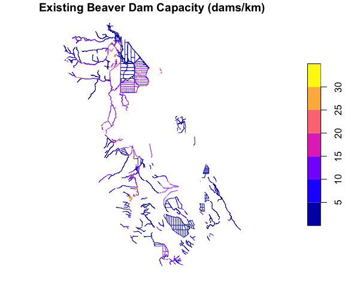
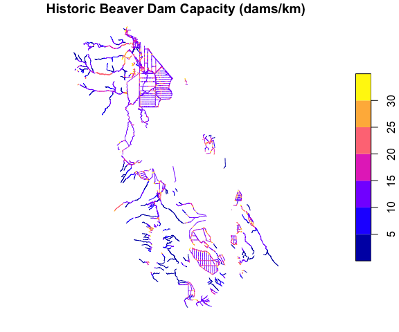
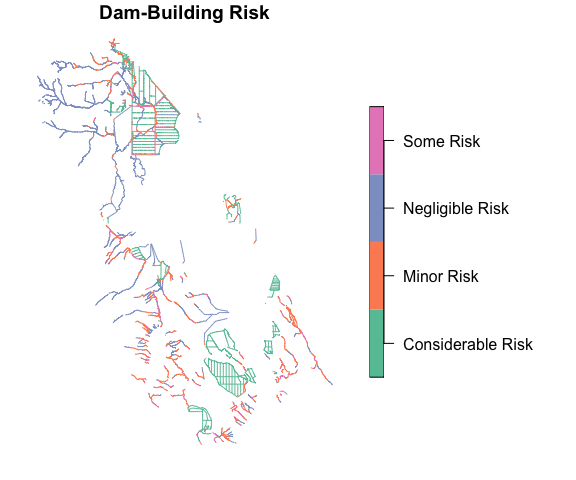

Overview of BRAT: Beaver Restoration Assessment Tool
================
Badhia Yunes-Katz
2026-08-12

# 1. What is BRAT?

The [**Beaver Restoration Assessment Tool
(BRAT)**](https://tools.riverscapes.net/brat/) is a spatial model built
by the Riverscapes Consortium. It is used for estimation and planning::

> Beaver dams per kilometer for every stream reach in a network
> Potential physical support in that reach, if beaver were present

This is called **dam-building capacity**. BRAT calculates it twice for
every reach:

- **Existing capacity** — based on *current* vegetation and conditions
- **Historic capacity** — based on *pre-European-settlement* vegetation,
  representing what the reach could have supported before land-use
  change

Comparing these two numbers is one of BRAT’s most powerful uses: it
shows where beaver capacity has been **lost** over time, and by how
much.

BRAT also layers on a **risk and opportunity assessment**, flagging
reaches where high dam-building capacity would sit right next to a road,
railroad, canal, or private land.

BRAT is typically run once per watershed (HUC) and the results are
archived on the [Riverscapes Data
Exchange](https://data.riverscapes.net) as a GeoPackage. That GeoPackage
usually contains 20+ layers, but most analysis only needs one:

| Layer                                                             | What it is                                                                                                                        |
|-------------------------------------------------------------------|-----------------------------------------------------------------------------------------------------------------------------------|
| `vwReaches`                                                       | The main table. Every reach, fully joined with all inputs, outputs, and readable risk/opportunity labels. Use this one.           |
| `vwDgos` / `vwIgos`                                               | The same information aggregated over a smoothed riverscape segment instead of per-reach, useful for a less noisy, zoomed-out view |
| `ReachGeometry`, `DGOGeometry`, `IGOGeometry`                     | Bare spatial geometry with no attributes                                                                                          |
| `DamRisks`, `DamLimitations`, `DamOpportunities`, `DamCapacities` | Small lookup tables defining what the categorical codes mean                                                                      |
| `MetaData`                                                        | Records when and how this specific project was generated                                                                          |

``` r
# Point this at wherever you downloaded/extracted the BRAT GeoPackage
project_dir <- "data-raw/data-exploration/ukl-brat"

gpkg <- list.files(project_dir, pattern = "\\.gpkg$", recursive = TRUE, full.names = TRUE)
gpkg
```

    ## [1] "data-raw/data-exploration/ukl-brat/brat.gpkg"         
    ## [2] "data-raw/data-exploration/ukl-brat/inputs/inputs.gpkg"
    ## [3] "data-raw/data-exploration/ukl-brat/outputs/brat.gpkg"

``` r
ukl_reaches <- st_read(gpkg[1], layer = "vwReaches", quiet = TRUE)

nrow(ukl_reaches)
```

    ## [1] 3926

The examples below use the Long Lake Valley – Upper Klamath Lake
sub-basin, which contains 3926 individual stream reaches.

------------------------------------------------------------------------

# 2. The inputs (what goes into the model)

Every input column is prefixed with **`i`**. They fall into four groups:

### Vegetation (forage & building material)

- `iVeg_30EX`, `iVeg100EX` — existing vegetation suitability, in a 30m
  and 100m buffer around the stream
- `iVeg_30HPE`, `iVeg100HPE` — same, but for historic vegetation

Vegetation suitability is a score from 0 to 4, rating how useful a given
vegetation type is as beaver food or dam-building material, with willow,
cottonwood, and aspen scoring highest and conifer forest, bare ground,
or developed land scoring lowest. This score is assigned by classifying
LANDFIRE vegetation data, existing vegetation for current conditions and
Biophysical Settings for historic conditions, against a standard set of
suitability criteria developed for BRAT. Each reach’s score is the
average suitability of the vegetation surrounding it. The 30m buffer
reflects beavers’ preferred foraging distance from the stream, while the
100m buffer captures the wider area beavers will use if what’s closer
isn’t enough.

### Topography & channel geometry

- `iGeo_Slope` — average channel slope
- `iGeo_Len` — reach length
- `iGeo_DA` — upstream drainage area

### Hydrology (flow & stream power)

- `iHyd_QLow` — low-flow discharge (ft³/s)
- `iHyd_Q2` — 2-year flood discharge (ft³/s)
- `iHyd_SPLow`, `iHyd_SP2` — stream power at those flows, derived from
  discharge and slope

### Infrastructure & land-use context

- `iPC_Road`, `iPC_RoadX`, `iPC_RoadVB` — distance to roads/road
  crossings
- `iPC_Rail`, `iPC_RailVB` — distance to railroads
- `iPC_Canal`, `iPC_DivPts` — distance to canals/diversions
- `iPC_Privat` — distance to private land
- `iPC_LU`, `iPC_VLowLU`, `iPC_LowLU`, `iPC_ModLU`, `iPC_HighLU` —
  land-use intensity

``` r
ukl_reaches |> 
  filter(!is.na(StreamName)) |> 
  st_drop_geometry() |> 
  select(StreamName, iVeg100EX, iGeo_Slope, iHyd_QLow, iPC_Road) |> 
  head(5) |> 
  kable(caption = "A few example input values for Long Lake Valley reaches")
```

| StreamName      | iVeg100EX | iGeo_Slope | iHyd_QLow | iPC_Road |
|:----------------|----------:|-----------:|----------:|---------:|
| Link River      |      2.81 |  0.0136830 | 0.0001101 |       15 |
| Link River      |      2.81 |  0.0300596 | 0.0001101 |       15 |
| Caledonia Canal |      1.47 |  0.0014000 | 0.9324834 |       21 |
| Caledonia Canal |      1.36 |  0.0013120 | 0.9324834 |       19 |
| Caledonia Canal |      1.88 |  0.0007694 | 0.6927642 |      199 |

A few example input values for Long Lake Valley reaches

------------------------------------------------------------------------

# 3. The outputs (what the model calculates)

Output/model-result columns are prefixed **`o`** or **`m`**:

- **`oVC_EX` / `oVC_HPE`** — vegetation-only capacity estimate (an
  intermediate step)
- **`oCC_EX`** — **final existing capacity**, in dams/km — the model’s
  headline result
- **`oCC_HPE`** — final historic capacity, in dams/km
- **`mCC_EX_CT` / `mCC_HPE_CT`** — the same thing expressed as a dam
  *count* for the reach, rather than a density
- **`mCC_HisDep`** — how much capacity has been lost compared to
  historic conditions
- **`Risk`**, **`Limitation`**, **`Opportunity`** — human-readable
  categorical labels describing conflict risk, what’s holding capacity
  down, and restoration potential

``` r
plot(ukl_reaches["oCC_EX"],
     main = "Existing Beaver Dam Capacity (dams/km)")
```

<!-- -->

``` r
plot(ukl_reaches["oCC_HPE"],
     main = "Historic Beaver Dam Capacity (dams/km)")
```

<!-- -->

``` r
plot(ukl_reaches["Risk"],
     main = "Dam-Building Risk")
```

<!-- -->

``` r
summary(ukl_reaches$oCC_EX)
```

    ##    Min. 1st Qu.  Median    Mean 3rd Qu.    Max.    NA's 
    ##    0.00    3.62    4.83    8.25   12.76   31.48       2

``` r
summary(ukl_reaches$oCC_HPE)
```

    ##    Min. 1st Qu.  Median    Mean 3rd Qu.    Max.    NA's 
    ##    0.00   10.63   12.76   14.18   17.60   31.48       2

``` r
table(ukl_reaches$Risk)
```

    ## 
    ## Considerable Risk        Minor Risk   Negligible Risk         Some Risk 
    ##              1573               800              1077               474

``` r
table(ukl_reaches$Opportunity)
```

    ## 
    ##                                  Beaver Mimicry 
    ##                                             937 
    ##                             Conflict Management 
    ##                                             197 
    ##      Conservation/Appropriate for Translocation 
    ##                                             474 
    ##         Encourage Beaver Expansion/Colonization 
    ##                                             152 
    ##                          Land Management Change 
    ##                                             121 
    ##            Natural or Anthropogenic Limitations 
    ##                                            2017 
    ## Potential Floodplain/Side Channel Opportunities 
    ##                                              26

## A simple, readable summary table

``` r
ukl_summary_table <- ukl_reaches %>%
  filter(!is.na(StreamName)) |> 
  st_drop_geometry() %>%
  transmute(
    `Stream Name`                      = StreamName,
    `Stream Order`                     = stream_order,
    `Land Owner`                       = ownership,
    `Length (m)`                       = round(iGeo_Len, 1),
    `Existing Dam Capacity (dams/km)`  = round(oCC_EX, 2),
    `Historic Dam Capacity (dams/km)`  = round(oCC_HPE, 2),
    Risk, Limitation, Opportunity
  ) %>%
  arrange(desc(`Existing Dam Capacity (dams/km)`))

ukl_summary_table %>%
  head(10) %>%
  kable(caption = "Top 10 reaches by existing beaver dam capacity")
```

| Stream Name       | Stream Order | Land Owner | Length (m) | Existing Dam Capacity (dams/km) | Historic Dam Capacity (dams/km) | Risk            | Limitation            | Opportunity                                |
|:------------------|-------------:|:-----------|-----------:|--------------------------------:|--------------------------------:|:----------------|:----------------------|:-------------------------------------------|
| Bridge Creek      |            1 | PVT        |      171.8 |                           31.48 |                           31.48 | Some Risk       | Dam Building Possible | Conflict Management                        |
| Swan Creek        |            1 | PVT        |       34.4 |                           31.48 |                           29.25 | Negligible Risk | Dam Building Possible | Conservation/Appropriate for Translocation |
| Odessa Creek      |            3 | USFS       |      163.4 |                           31.48 |                           29.58 | Negligible Risk | Dam Building Possible | Conservation/Appropriate for Translocation |
| Pelican Cut Canal |            1 | PVT        |       37.6 |                           31.31 |                           31.31 | Negligible Risk | Dam Building Possible | Conservation/Appropriate for Translocation |
| Swan Creek        |            1 | PVT        |      161.6 |                           30.60 |                           30.25 | Negligible Risk | Dam Building Possible | Conservation/Appropriate for Translocation |
| Swan Creek        |            1 | PVT        |      299.8 |                           30.41 |                           28.05 | Minor Risk      | Dam Building Possible | Conservation/Appropriate for Translocation |
| South Creek       |            2 | PVT        |      178.4 |                           30.36 |                           30.19 | Negligible Risk | Dam Building Possible | Conservation/Appropriate for Translocation |
| Crane Creek       |            3 | USFS       |       16.2 |                           30.29 |                           21.79 | Negligible Risk | Dam Building Possible | Encourage Beaver Expansion/Colonization    |
| Fourmile Creek    |            4 | PVT        |      121.1 |                           30.23 |                           31.48 | Negligible Risk | Dam Building Possible | Conservation/Appropriate for Translocation |
| Bridge Creek      |            1 | PVT        |       73.4 |                           30.21 |                           27.69 | Some Risk       | Dam Building Possible | Conflict Management                        |

Top 10 reaches by existing beaver dam capacity

------------------------------------------------------------------------

# 4. Can the inputs be modified?

The BRAT project contains the inputs, intermediates, parameters, and
outputs used to generate the model results. However, the downloaded
GeoPackage represents the results of a completed BRAT model run.

Although the input attributes can be edited, modifying these values in
the GeoPackage does not regenerate the model outputs. The documentation
describes BRAT outputs as the product of a modeling workflow consisting
of the BRAT Table Tool, iHyd Attributes Tool, Vegetation Dam Capacity
Model, and Combined Dam Capacity Model, which are run sequentially to
produce the final outputs.

The documentation states that:

> “The majority of users of BRAT will not actually run BRAT themselves,
> but instead will download BRAT outputs and summary products for use in
> beaver-related stream conservation and restoration efforts.”

It also explains that users can:

> “…interact with the BRAT outputs… provide lookup tables for
> investigative purposes… and… access and interrogate the outputs.”

For users who wish to evaluate different conditions, the documented
approach is to rerun the BRAT workflow using the sequence of BRAT tools
rather than modifying the downloaded output tables.

------------------------------------------------------------------------

# 5. Summary

| Question                                         | Answer                                                                                                                                        |
|--------------------------------------------------|-----------------------------------------------------------------------------------------------------------------------------------------------|
| What does BRAT tell us?                          | How many beaver dams per km a stream reach could support, now and historically                                                                |
| What’s the main table to use?                    | `vwReaches`                                                                                                                                   |
| What are the key output columns?                 | `oCC_EX`, `oCC_HPE`, `Risk`, `Limitation`, `Opportunity`                                                                                      |
| Can inputs be changed to explore scenarios?      | Yes, but outputs won’t recalculate automatically; the real model must be rerun                                                                |
| Is this data reliable for refuge planning as-is? | Yes. The existing and historic capacity and risk/opportunity layers are directly usable for identifying priority reaches without modification |
