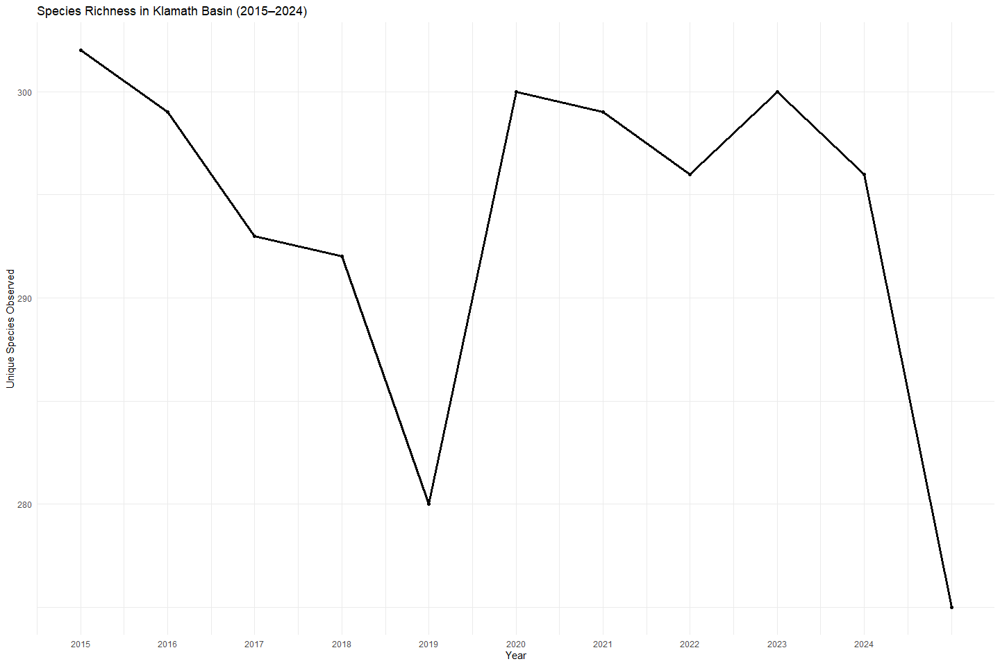
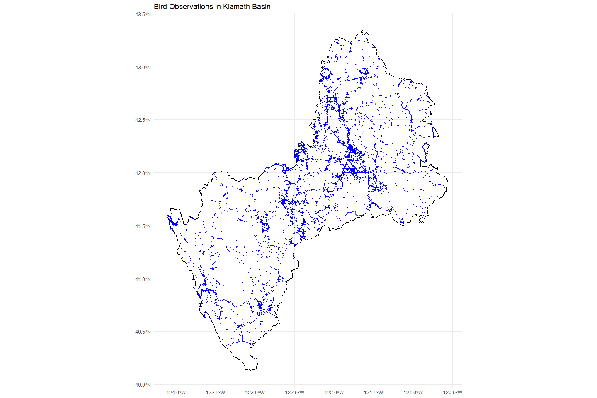
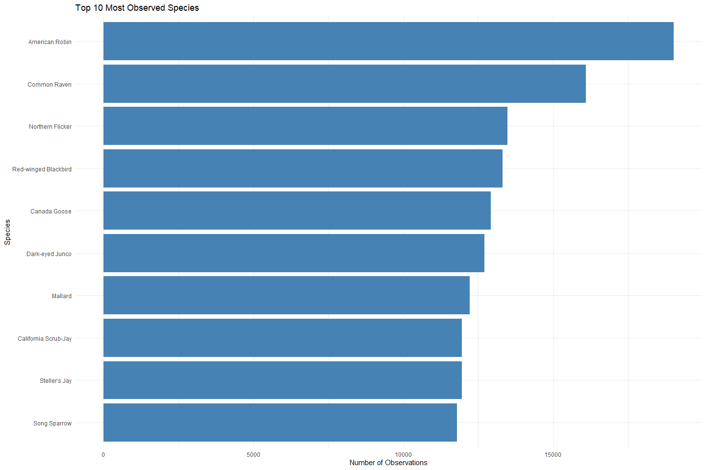
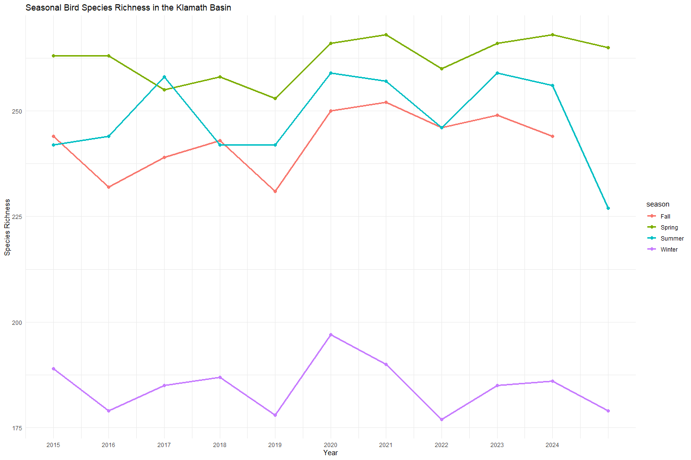
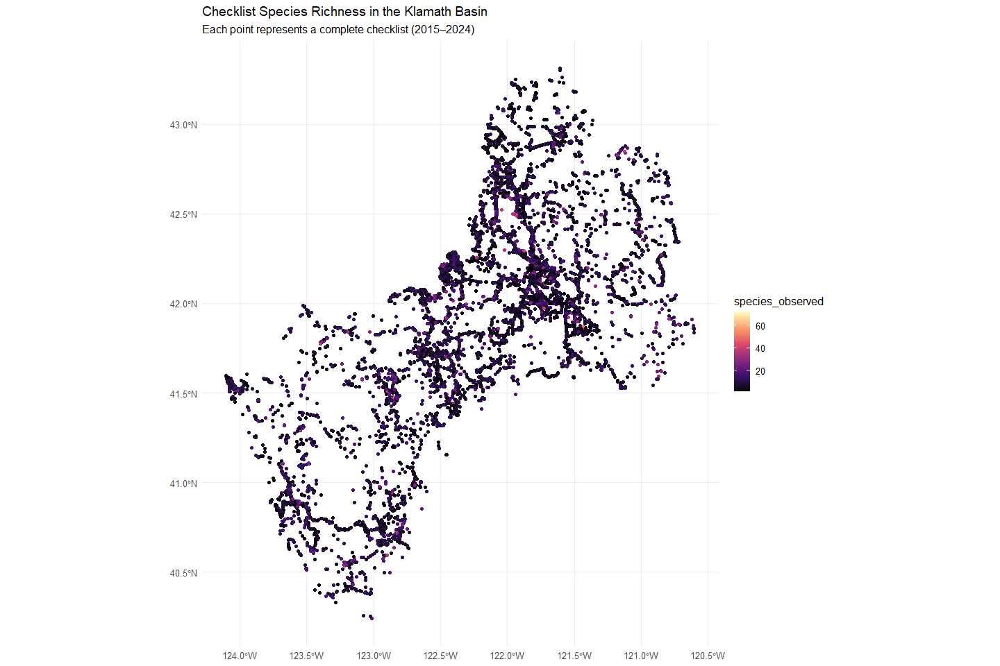
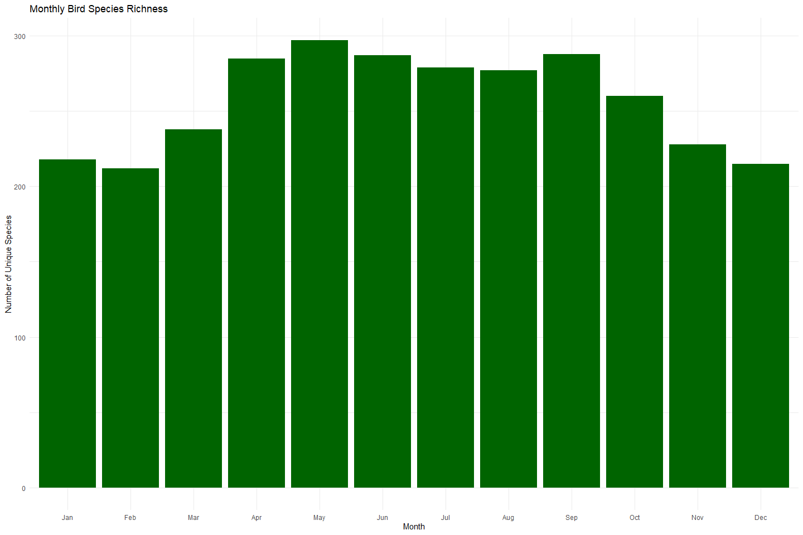

Species Richness Analysis in the Klamath Basin (2015–2025)
================
Badhia Yunes Katz
July 2025

The purpose of this markdown is to analyze and explore bird species
richness across the Klamath Basin over the past 10 years using publicly
available eBird data.

## Data Source

Data were obtained from the [eBird Basic Dataset
(EBD)](https://science.ebird.org/en/use-ebird-data/download-ebird-data-products)
via custom downloads. The following counties intersecting the Klamath
Basin were included:

- California: Del Norte (CA-015), Humboldt (CA-023), Modoc (CA-049),
  Siskiyou (CA-093), Trinity (CA-105)

- Oregon: Jackson (OR-029), Lake (OR-037), Klamath (OR-035)

Each download included:

- Observation data (.txt)

- Sampling event metadata (\_sampling.txt)

- Data filtered using the
  [auk](https://cornelllabofornithology.github.io/auk/) R package

## Spatial Filtering

A shapefile representing the Klamath Basin watershed boundary was used
to:

- Limit observations to only those falling within the basin

- Ensure accurate spatial representation of species richness and effort

Spatial filtering was performed using the sf R package, with
observations reprojected and subset using spatial joins.

## Limitations and Biases

While eBird provides a vast and valuable source of bird observation
data, several **limitations and biases** must be considered when
interpreting species richness in the Klamath Basin:

### Spatial and Temporal Bias

- **Uneven geographic coverage**: Observations are concentrated near
  roads, towns, protected areas, or known birding hotspots rather than
  being evenly distributed across the basin.
- **Accessibility**: Remote, rugged, or private lands are under-surveyed
  due to difficulty of access.
- **Temporal bias**: Observations are skewed toward **weekends**,
  holidays, and the **month of May**, when birding activity typically
  increases due to spring migration and favorable weather.

### Observer Skill and Experience

- Bird detection and identification are highly dependent on the skill
  level of the observer:
  - **Novice observers** may miss or misidentify species, especially
    cryptic or similar-looking birds.
  - **Experienced birders** may detect more species per checklist,
    leading to inflated richness in certain areas.

### Personal Preference and Targeting

- Observer decisions introduce subjectivity:
  - Birders may intentionally seek out **rare** or **charismatic**
    species.
  - Areas near homes, parks, or favorite hotspots may be surveyed more
    often.
  - “Chasing” behavior (targeting recent rare sightings) may
    artificially inflate species counts at specific locations.

### Checklist Effort and Metadata Variability

- Despite quality filters (complete checklists, effort constraints),
  variability remains in:
  - **Number of observers**
  - **Start time of surveys**
  - **Use of playback, feeders, or attractants**

These factors influence the likelihood of species detection.

### Presence-Only Limitations

- eBird is a **presence-only** dataset.
  - A species not reported on a checklist does **not imply absence**—it
    may simply have gone undetected.
  - Species with low detectability or limited seasonal presence may be
    underrepresented.

[This markdown follows ebird best
practices](https://ebird.github.io/ebird-best-practices/)

## Temporal Trends in Species Richness

This plot shows the total number of unique species recorded per year.
Peaks may correspond to years with higher survey effort, observer
participation, or migration events.

<!-- -->

## Spatial coverage map

This map displays all checklists within the Klamath Basin. Denser
clusters likely reflect accessibility (e.g., roads, hotspots) and
observer preferences.

<!-- -->

## Top 10 Most Frequently Observed Species

These species are the most commonly reported across all checklists,
often due to being common, conspicuous, or resident year-round.

The most common species is American Robin

<!-- -->

Seasonal Bird Species Richness

Spring is the season with more observations from bird watchers, and
winter is the lowest. This is not surprising due to the frequency of
when people spend time outside during these seasons.

- Note that this can be misinterpreted due to the temporal variability
  of bird watchers

<!-- -->

Checklist Species Richness in Klamath Basin

species_observed value in your code represents the number of unique
species recorded in each individual eBird checklist

<!-- -->

## Monthly Richness Trends

Richness peaks in spring and early summer, again corresponding to
migration and peak observation periods

<!-- -->
